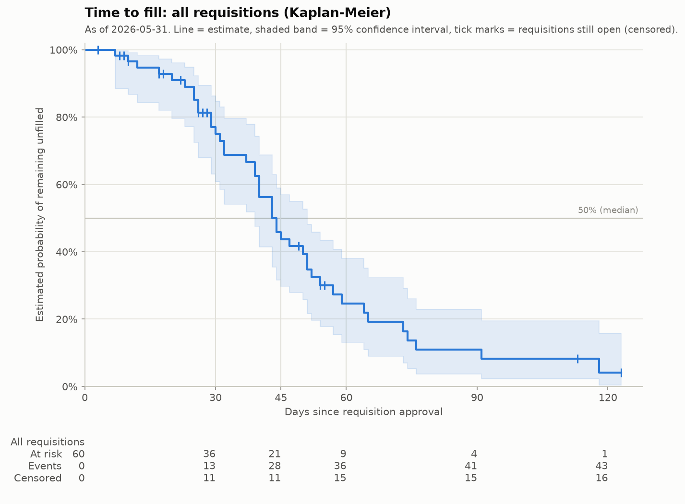
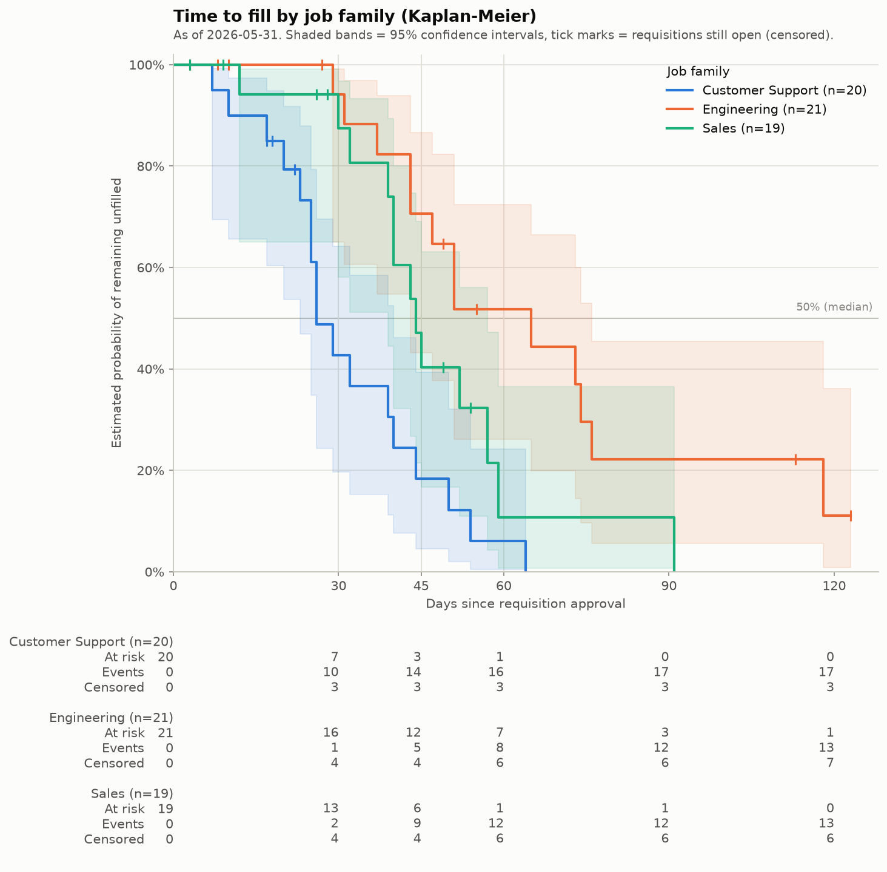

# Time-to-Fill Survival Analysis (dbt + DuckDB + Python)

A small, runnable portfolio project. It shows how a recruitment team can analyze
**time to fill** without ignoring requisitions that are **still open**.

- **dbt + DuckDB** prepare one clean table with the business rules: when the clock
  starts, what counts as a fill, and what we could know on the reporting date.
- **Python + lifelines** estimate Kaplan–Meier survival curves from that table and
  compare them with the usual "filled requisitions only" statistics.

The dataset is small and **synthetic**. The project demonstrates the method. It does
not measure real hiring performance or set real hiring targets (SLAs).

---

## 1. Business problem

Recruitment dashboards often report "average time to fill" from **filled requisitions
only**. That statistic leaves out every requisition that is still open on the reporting
date, even though those requisitions carry information: we know each one has been
unfilled for at least its current age.

So a filled-only average describes the requisitions that already finished. It does not
describe all the hiring activity that is still in progress, and it gives an incomplete
picture of how long hiring takes. The open requisitions are not always the hardest
ones, but leaving them out means the metric ignores part of the evidence.

**Survival analysis** (here, the Kaplan–Meier method) uses both groups:

- filled requisitions tell us *when* a fill happened;
- open requisitions tell us *how long they stayed unfilled, at least* (they are
  **right-censored**: "censored" means we stopped watching before the outcome happened).

### Questions this project answers

1. What is the estimated probability that a requisition is **still unfilled after 30,
   45 and 60 days**?
2. How does this differ by **job family**?
3. What is the estimated **median time to fill**?
4. How do these results differ from statistics based **only on filled requisitions**?

### Scope

| In scope | Out of scope |
|---|---|
| One synthetic source table (60 eligible requisitions) | Real ATS data, other sources |
| Two dbt models + dbt tests | Orchestration, cloud, Docker, APIs, dashboards |
| Kaplan–Meier curves with 95% confidence intervals | Cox regression, hypothesis tests, competing risks |
| Group comparison by job family (descriptive) | Predictions for individual requisitions |

---

## 2. Architecture

```text
scripts/create_sample_data.py      writes  raw.requisitions            (DuckDB)
        │
        ▼
dbt: stg_requisitions (view)       clean types, no business rules
        │
        ▼
dbt: mart_requisition_survival     one row per eligible requisition:
     (table) + dbt tests           duration_days, event_observed, status
        │
        ▼
scripts/run_survival_analysis.py   Kaplan–Meier curves, summary table
        │
        ▼
outputs/  km_overall.png, km_by_job_family.png, time_to_fill_summary.csv
```

All data lives in one local DuckDB file: `data/recruitment.duckdb`.

**Division of work**

| dbt (SQL) owns | Python owns |
|---|---|
| Which requisitions are eligible | Fitting Kaplan–Meier curves |
| The reporting date (`analysis_as_of_date`) | Confidence intervals, medians, probabilities |
| Fill event, observation end, duration, status | "Insufficient follow-up" and "Not reached" rules |
| Data quality tests | Charts, CSV, terminal summary |

Python reads `duration_days` and `event_observed` from the mart. It never recalculates
them. This keeps one definition of "time to fill" that SQL users, BI tools and Python
all share.

---

## 3. Repository layout

```text
.
├── README.md
├── docs/
│   └── walkthrough.md                  step-by-step guide and statistics explainer
├── pyproject.toml                      Python dependencies (managed by uv) + Ruff config
├── uv.lock                             exact, locked dependency versions
├── .python-version                     Python 3.12
├── dbt_project.yml                     dbt project + the reporting date variable
├── profiles.yml                        dbt connection to data/recruitment.duckdb
├── models/
│   ├── staging/
│   │   ├── _sources.yml                source table raw.requisitions + tests
│   │   ├── stg_requisitions.sql
│   │   └── stg_requisitions.yml
│   └── marts/
│       ├── mart_requisition_survival.sql
│       └── mart_requisition_survival.yml   column docs, tests, unit test
├── tests/                              singular dbt tests (SQL rules)
├── scripts/
│   ├── create_sample_data.py
│   └── run_survival_analysis.py
├── data/                               DuckDB file is created here (not committed)
└── outputs/                            charts and summary table
```

---

## 4. Setup and run

**Prerequisite:** install [uv](https://docs.astral.sh/uv/getting-started/installation/).
uv installs the right Python version (3.12) for you.

Run every command **from the project root folder**, in this order, one at a time.
The commands work the same in PowerShell, macOS Terminal and Linux shells.

```powershell
# 1. Install the locked dependencies into .venv
uv sync

# 2. Create the synthetic source table raw.requisitions
uv run python scripts/create_sample_data.py

# 3. Build and test the dbt models (staging view, mart table, all tests)
uv run dbt build

# 4. Run the survival analysis (charts + summary table)
uv run python scripts/run_survival_analysis.py

# Optional: lint and format check
uv run ruff check .
uv run ruff format --check .
```

Steps 2–4 write to or read from the same DuckDB file. DuckDB allows only one writing
process at a time, so run them one after the other, and close any other tool that has
`data/recruitment.duckdb` open (for example, a SQL editor).

### Verified run

The steps above were run in a clean Linux environment with Python 3.12, dbt-core
1.12.5, dbt-duckdb 1.11.0 and lifelines 0.30.3 (versions locked in `uv.lock`):

- `dbt build`: `PASS=26 WARN=0 ERROR=0` (1 unit test, 23 data tests, 2 models).
- The analysis script finished and wrote the three files in `outputs/`.
- `ruff check` and `ruff format --check`: no issues.

The workflow has not been run on Windows yet. The commands avoid shell-specific syntax,
but PowerShell has not been tested directly.

---

## 5. Outputs

### `outputs/km_overall.png`: one curve for all requisitions



### `outputs/km_by_job_family.png`: one curve per job family



How to read the charts:

- **Horizontal axis:** days since the requisition was approved.
- **Vertical axis:** estimated probability that a requisition is **still unfilled**
  after that many days. The curve starts at 100% and steps down each time a
  requisition is filled.
- **Shaded band:** 95% confidence interval, the range of values consistent with this
  small sample. Wider band = less certainty.
- **Tick marks (|):** censored requisitions. Each one was still open on the reporting
  date, at that age.
- **Grey vertical lines** mark days 30, 45 and 60. The horizontal line marks 50%. Where
  a curve crosses it is the estimated median.
- **At-risk table** under each chart:
  - *At risk* = requisitions still being observed and not yet filled at that day
    (lifelines counts them at the end of the day).
  - *Events* = fills so far.
  - *Censored* = requisitions that left the data while still open, so far.
  For every group, At risk + Events + Censored = the group size.

### `outputs/time_to_fill_summary.csv`: summary table

One row for all requisitions, plus one row per job family.

| Column | Meaning |
|---|---|
| `requisitions` | Requisitions approved on or before the reporting date |
| `filled_by_as_of_date` | Offers accepted on or before the reporting date (events) |
| `open_right_censored` | Still open on the reporting date (censored) |
| `longest_observed_days` | Longest duration in the group, filled or open |
| `filled_only_mean_days` | Mean days to fill, **filled requisitions only** |
| `filled_only_median_days` | Median days to fill, **filled requisitions only** |
| `km_median_days` | **Kaplan–Meier** estimated median time to fill |
| `km_unfilled_after_30d` / `45d` / `60d` | **Kaplan–Meier** estimated share still unfilled, with 95% confidence interval in brackets |

Special values:

- `Not reached within observed follow-up`: the curve never drops to 50%, so the median
  cannot be estimated from the data we have.
- `Insufficient follow-up`: the requested day is later than the longest duration
  observed in that group. The curve does not tell us anything there, so the script
  refuses to report a number.

The `filled_only_*` and `km_*` columns summarize **different information** and are
not interchangeable. The filled-only columns describe only the requisitions that
finished. The Kaplan–Meier columns estimate the whole group, including the open
requisitions.

### Results from the synthetic sample (reporting date 2026-05-31)

This is the actual terminal output of `run_survival_analysis.py` on this repository's
data:

```text
group                   All requisitions Customer Support    Engineering          Sales
requisitions                          60               20             21             19
filled_by_as_of_date                  43               17             13             13
open_right_censored                   17                3              8              6
longest_observed_days                123               64            123             91
filled_only_mean_days               43.1             31.2           56.8           44.9
filled_only_median_days             40.0             26.0           51.0           43.0
km_median_days                        44               26             65             44
km_unfilled_after_30d      75% (61%-85%)    43% (20%-64%)  94% (65%-99%)  87% (58%-97%)
km_unfilled_after_45d      44% (30%-57%)     18% (5%-39%)  71% (43%-87%)  40% (17%-63%)
km_unfilled_after_60d      25% (13%-38%)      6% (0%-24%)  52% (26%-72%)   11% (1%-36%)
```

What this sample shows:

- **All requisitions:** an estimated 44% were still unfilled 45 days after approval
  (95% CI 30%–57%). The KM median is 44 days. The filled-only median is 40 days, and the
  filled-only mean (43.1 days) leaves out 17 of the 60 requisitions.
- **Engineering** has the most open requisitions (8 of 21), including two open for more
  than 110 days. Here the gap is largest: filled-only median **51 days** vs KM median
  **65 days**. The filled-only number looks faster because many of the slowest
  Engineering requisitions have not finished yet.
- **Customer Support** has only 3 open requisitions, so filled-only and KM medians
  agree (26 days). When few requisitions are censored, the two approaches give
  similar answers.
- The confidence intervals are wide, and several overlap. With about 20 requisitions
  per group, the group differences are **descriptive**. They do not prove that job
  family *causes* slower hiring, and this project runs no statistical tests.
- The job families differ **because the simulation was set up that way** (typical fill
  times of 28, 40 and 60 days in `create_sample_data.py`). The analysis recovers that
  designed pattern, which is a useful check of the method, not a finding about real
  hiring.

---

## 6. Business definitions

| Term | Definition in this project |
|---|---|
| Start | Requisition approval date (`approved_date`) |
| Fill event | First accepted offer (not the new hire's start date) |
| Reporting date | `analysis_as_of_date` = **2026-05-31**, set once in `dbt_project.yml` |
| Eligible | Approved on or before the reporting date |
| `event_observed` | 1 if the offer was accepted **on or before** the reporting date, else 0 |
| `observation_end_date` | Acceptance date if `event_observed = 1`, else the reporting date |
| `duration_days` | `observation_end_date - approved_date`, calendar days |
| `status_as_of_date` | `Filled` or `Open`, derived from the dates above |

The source contains 6 offers accepted **after** 2026-05-31 and 3 requisitions approved
after it. The mart treats those acceptances as not yet happened (`Open`, censored on
2026-05-31) and excludes the late approvals. This prevents **leakage**: using
information from after the reporting date in a historical analysis.

See [docs/walkthrough.md](docs/walkthrough.md) for worked examples of each case.

---

## 7. Data quality checks

**dbt tests** (run by `dbt build`):

- Requisition IDs are unique and not null (source, staging, mart).
- Job family, site and approval date are present (source and mart). All other
  mart columns except `offer_accepted_date` are also not null.
- An offer is never accepted before approval (`tests/assert_acceptance_not_before_approval.sql`).
- `duration_days` is never negative.
- `event_observed` is only 0 or 1. `status_as_of_date` is only `Filled` or `Open`.
- `observation_end_date` is never after the reporting date.
- **Unit test** `cutoff_rules_for_event_flag_and_duration`: hand-made rows prove that an
  acceptance *on* the reporting date counts as a fill, an acceptance *after* it does
  not, and a requisition approved after it is excluded.
- Every eligible requisition appears exactly once in the mart, and filled + censored
  = total (`tests/assert_counts_reconcile.sql`).

**Python checks** (lightweight): the mart has exactly one reporting date. Every
survival curve stays between 0 and 1 and never increases. Filled + censored = total
in the summary table.

---

## 8. Assumptions and limitations

Simplifying assumptions in the synthetic data:

- Each requisition represents **exactly one position**.
- The **first accepted offer** is the fill event.
- There are **no cancellations, holds, reopenings, rescinded offers or multiple
  accepted offers**.
- Every requisition is **observed from its approval date** (no late entry into the data).
- Job family and site **do not change** over time.

**Cancelled requisitions need a deliberate policy.** A cancelled requisition is not the
same as one that is still open on the reporting date. Treating cancellation as ordinary
censoring assumes the role would have filled like the others if it had continued, which
is often not true. Excluding it, censoring it at the cancellation date, or modelling
cancellation as a separate outcome (competing risks) are different analytical choices.
The team should agree on one and document it. This project avoids the question by
having no cancellations.

Other limitations:

- **Key assumption of Kaplan–Meier:** within each group analyzed, censoring should not
  systematically hide different future fill behavior. Requisitions that are still open
  should, on average, go on to fill like similar requisitions that were observed longer.
  A fixed reporting date does **not** guarantee this. For example, if hiring conditions
  changed across approval months, the recently approved (mostly censored) requisitions
  may behave differently from older ones.
- **Small groups and limited follow-up.** With about 20 requisitions per job family,
  confidence intervals are wide. Late parts of each curve rest on very few requisitions
  (see the at-risk table).
- **Descriptive only.** Differences between job families are not causal and not tested
  statistically.
- **Synthetic data.** Numbers here are illustrations of the method, not benchmarks or
  hiring SLAs.
- **Reporting date vs data freshness.** The simulated extract was taken on 2026-06-10.
  Do not set the reporting date after the extract date: open requisitions would then
  look observed for days we have no data about.

---

## 9. Learn more

[docs/walkthrough.md](docs/walkthrough.md) explains survival analysis for analytics
engineers (with a five-requisition example worked by hand). It also recreates the
project from an empty folder, explains each file, and shows how to change the
reporting date.
